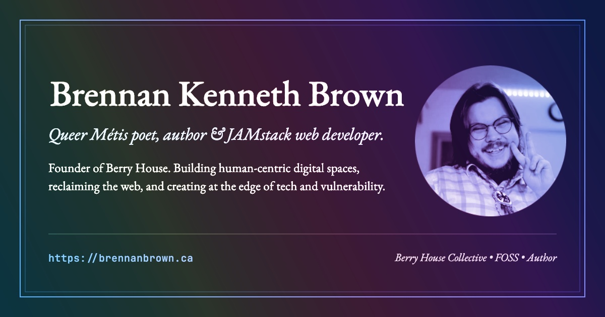

<!-- PROJECT -->
  <h3 align="center">Brennan's Portfolio</h3>

  <p align="center">
    A detailed showcase of my work, experience, and case studies.
    <br />
    <br />
    <b><a href="https://brennanbrown.ca">View Site</a></b>
    ·
    <a href="https://github.com/brennanbrown/marketing/issues">Report Bug</a>
    ·
    <a href="https://github.com/brennanbrown/marketing/issues">Request Feature</a>
  </p>

<p align="center">
  <a href="https://brennanbrown.ca"></a>
</p>

<!-- BADGES -->
<p align="center">

 
 
<a href="LICENSE"></a>
</p>

<!-- TABLE OF CONTENTS -->
**Table of Contents:**

- [About The Project](#about-the-project)
  - [Built With](#built-with)
- [Features](#features)
- [Site Sections](#site-sections)
  - [Pages](#pages)
- [Getting Started](#getting-started)
  - [Prerequisites](#prerequisites)
  - [Installation](#installation)
- [Project Structure](#project-structure)
- [Deployment](#deployment)
- [Usage, Roadmap and Contributing](#usage-roadmap-and-contributing)
- [License](#license)
- [Contact and Acknowledgements](#contact-and-acknowledgements)

<!-- ABOUT THE PROJECT -->
## About The Project

Here's my marketing portfolio, reflecting a modern, sophisticated, and professional approach. This site showcases in-depth marketing strategies, experiences, and case studies. It is created with Hugo and hosted on Netlify, featuring a design inspired by the Portio template by StaticMania.

### Built With

- [Hugo](https://gohugo.io/)
- [Netlify](https://netlify.com/)
- Inspired by [Portio Template](https://staticmania.com/products/portio)

<!-- FEATURES -->
## Features

- Portfolio case studies, writing archive, projects, books, stats, and support sections driven by YAML data files
- Contact form handled by Netlify Forms (no serverless functions required)
- [Decap CMS](https://decapcms.org/) for content editing at `/admin`
- RSS feed, JSON-LD structured data, Open Graph and Twitter Card metadata
- Microblogging page at `/microblogging`

<!-- SITE SECTIONS -->
## Site Sections

The homepage is assembled from section partials (`layouts/partials/`) rendered in order, each populated by a matching YAML file in `data/`:

1. **Hero**: banner intro
2. **About Me**: bio and portrait
3. **Work With Berry House**: studio/freelance pitch
4. **Skills**: tech stack icon grid
5. **Help Keep My FOSS Work Free & Accessible**: support callout
6. **My Books**: published books
7. **Writing Portfolio**: featured writing, linking to `/blog/`
8. **By the Numbers**: metrics and press highlights
9. **Jekyll, Hugo, & 11ty Themes**: released SSG themes
10. **Apps, Tools & Websites**: selected projects
11. **My Resume**: links out to [cv.brennanbrown.ca](https://cv.brennanbrown.ca)
12. **Testimonials** from others
13. **My Skills**: "why hire me" and skillsets
14. **My Services**: services offered
15. Bottom banner linking to [brennan.day](https://brennan.day)

### Pages

| Page | Source | Notes |
| ---- | ------ | ----- |
| `/portfolio/` | `content/portfolio/` | Case studies, each with its own page |
| `/projects/` | `content/projects/` | Apps, tools & websites |
| `/themes/` | `content/themes/` | Jekyll, Hugo & 11ty themes |
| `/books/` | `content/books/` | Books |
| `/stats/` | `content/stats/` | Metrics & press |
| `/support/` | `content/support/` | Ways to support the work |
| `/blog/` | `content/blog/` | Writing portfolio: posts canonical to external publications |
| `/contact/` | `content/contact/` | Netlify Forms contact page |
| `/microblogging/` | `static/microblogging/` | Static microblog page |
| `/admin/` | `static/admin/` | Decap CMS |
| `/Resume.pdf` | `static/Resume.pdf` | Resume PDF |

<!-- GETTING STARTED -->
## Getting Started

To get a local copy up and running follow these simple steps.

### Prerequisites

- Hugo Extended (v0.166.0 is used in production: see `netlify.toml`)
  ```sh
  brew install hugo
  ```

### Installation

1. Clone the repo
   ```sh
   git clone https://github.com/brennanbrown/marketing.git
   ```
2. Run the server (the Portio theme is vendored in `themes/`, no submodules needed)
   ```sh
   hugo server
   ```

<!-- PROJECT STRUCTURE -->
## Project Structure

```
├── assets/scss/      # Sass styles, compiled via Hugo Pipes
├── content/          # Page content (blog, portfolio, projects, etc.)
├── data/             # YAML data files driving the homepage sections
├── layouts/          # Templates and partials (override the theme)
├── static/           # Images, favicons, Decap CMS admin, microblogging
├── themes/portio/    # Vendored Portio theme
└── netlify.toml      # Netlify build config (Hugo 0.166.0, Node 22)
```

<!-- DEPLOYMENT -->
## Deployment

Deployed to [Netlify](https://netlify.com/) via `netlify.toml`. `hugo` builds to `public/` with Hugo 0.166.0 and Node 22 pinned. Deploy previews are generated for pull requests, and contact forms use Netlify Forms.

<!-- USAGE -->
## Usage, Roadmap and Contributing

For more examples, please refer to the [Documentation](https://gohugo.io/documentation/).

See the [open issues](https://github.com/brennanbrown/marketing/issues) for a list of proposed features (and known issues).

<!-- LICENSE -->
## License

This project is licensed under the GNU Affero General Public License v3.0, see the [LICENSE](LICENSE) file for details.

<!-- CONTACT -->
## Contact and Acknowledgements

Brennan Brown: [brennan.day](https://brennan.day) | [@brennan@social.lol](https://social.lol/@brennan) | mail@brennanbrown.ca

Project Link: [https://github.com/brennanbrown/marketing](https://github.com/brennanbrown/marketing)

- [Netlify](https://netlify.com/)
- [Hugo](https://gohugo.io/)
- [Portio Template](https://staticmania.com/products/portio)
- [Choose an Open Source License](https://choosealicense.com)
- [Img Shields](https://shields.io)
